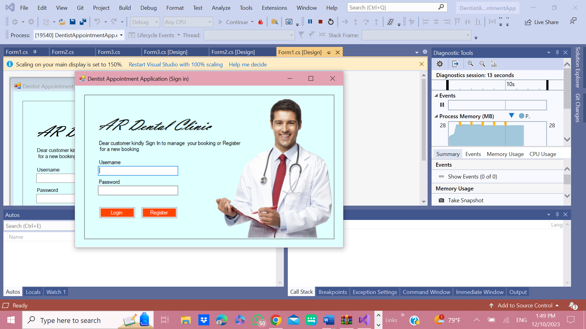
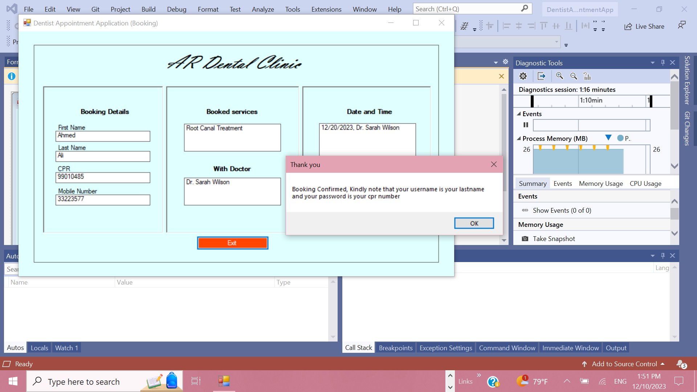
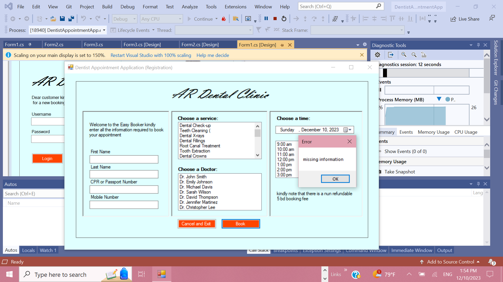
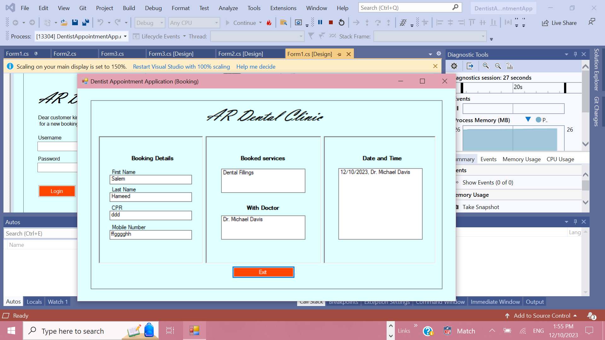
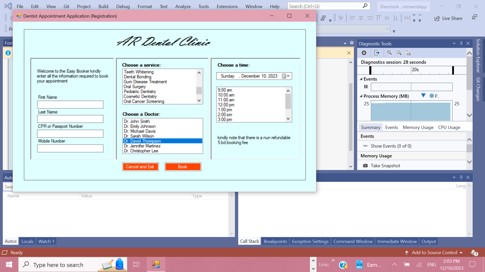
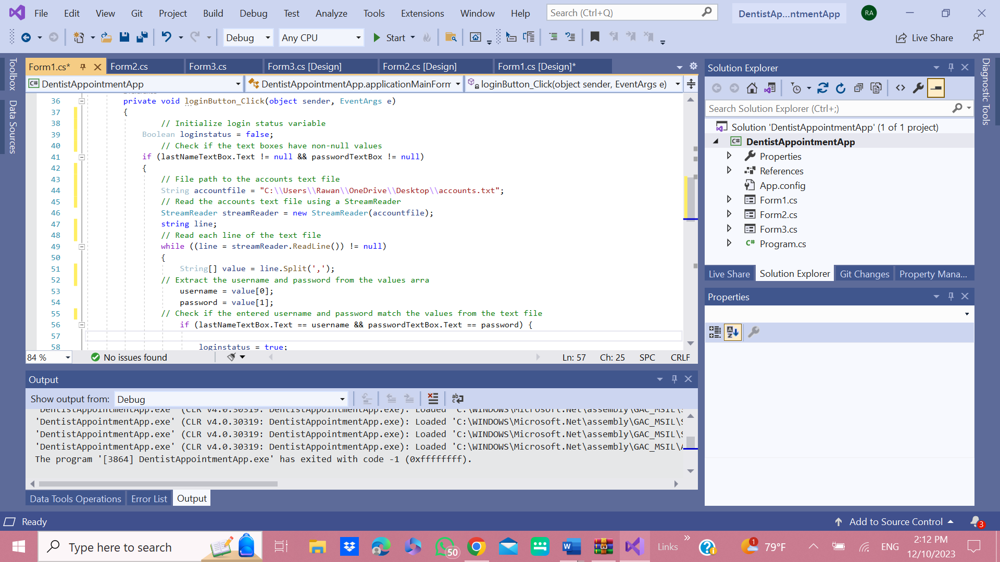
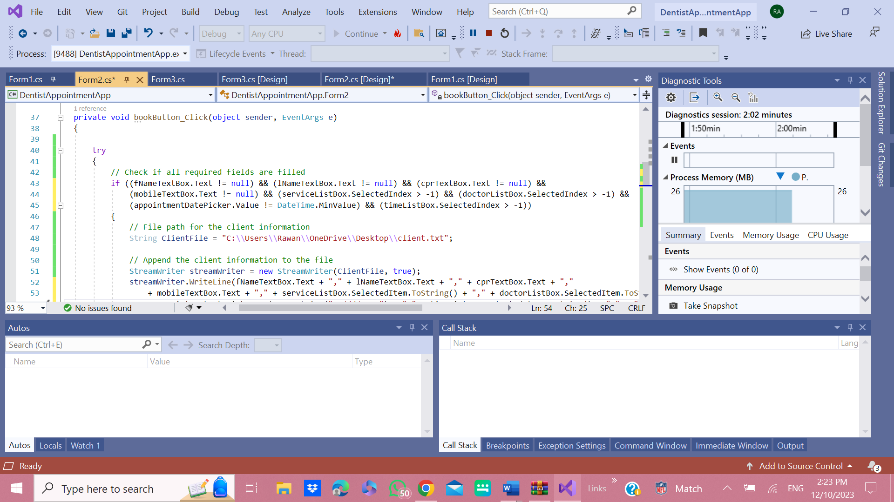
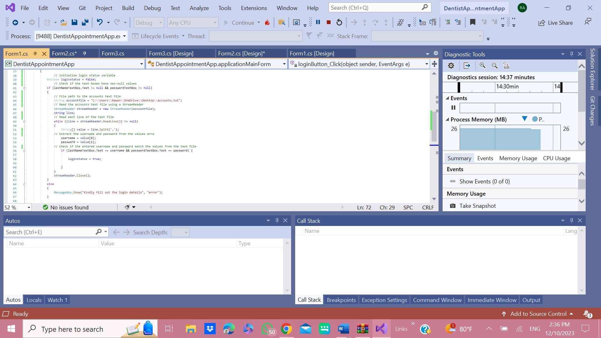
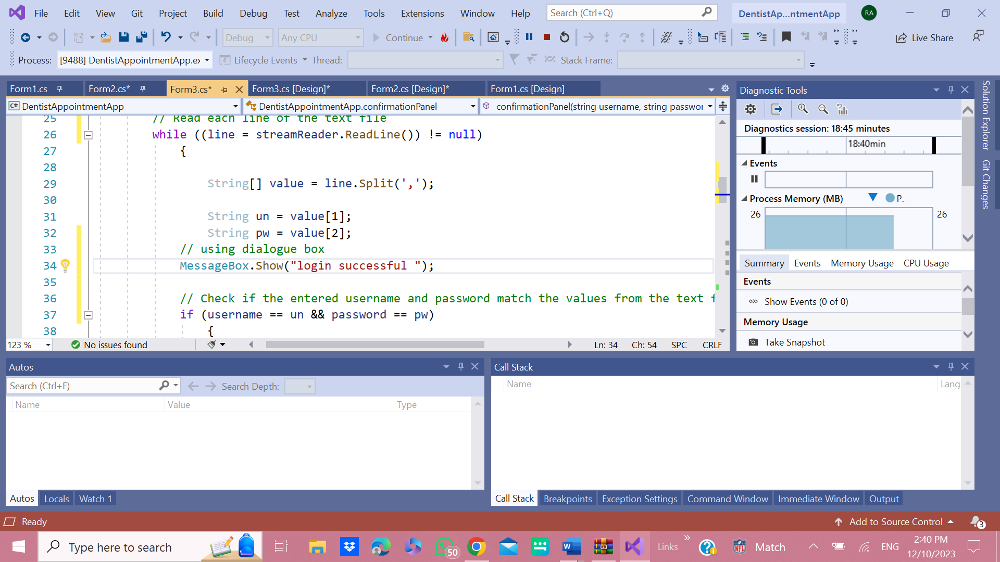
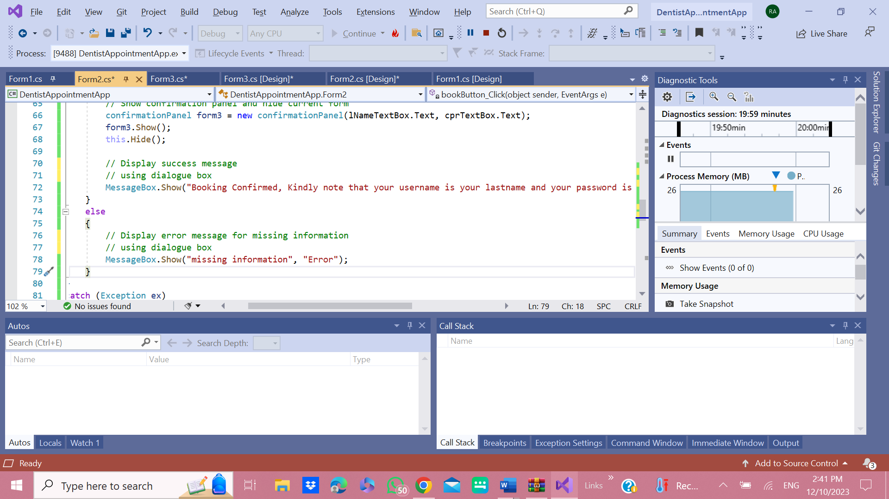

# Appointments Booking Application for AR Dental Clinic


## Project Information

- **Submitted By:** Rawan Albinzayed, Abdulla Alkooheji  
- **Course:** CMPE 361 - Windows Programming  
- **Instructor:** Dr. Khadija Almohsen  
- **Institution:** College of Engineering, American University of Bahrain  
- **Location:** Riffa, Kingdom of Bahrain  
- **Date:** December 10, 2023

---

## Introduction

Technology is increasingly being used in a variety of industries, including healthcare, in today's fast-paced world. One area where technology can be extremely beneficial in dental clinics is appointment management. Using an appointment booking app at AR Dental Clinic provides many benefits and convenience for both patients and clinic staff.

Our AR Dental Clinic Application provides an appointment booking application so that patients can schedule appointments at any time and from any location. Patients will save time and effort by not having to visit or call the clinic during business hours.

An appointment booking application's ease of use significantly improves the overall patient experience. Patients consider the ability to select their preferred appointment times and view dentist availability. It also can help reduce the number of no-shows and last-minute cancellations by charging a 5bd booking fee in advance, which they can then use later on their services.

---

## Main Functionalities

### 🔐 User Registration

Patients can create an account by entering their first and last names, contact information, and CPR or passport number.



### 📅 Appointment Scheduling

Patients can book an appointment by selecting their preferred date and time.



### 📋 Patient Information Management

The application provides simple access to patient information such as medical history, bookings, and contact information.



### 👨‍⚕️ Doctor Selection and Information

Provide a list of available dentists. Allow customers to choose their preferred dentist when scheduling an appointment.



### 📊 Appointment History

This is where clients and visitors can view their appointment history by logging in the application, which includes past and upcoming appointments. Include information such as the appointment date, time, and dentist.



---

## Principles of HCI Design

### ✅ Consistency

All buttons and controls are placed consistently across screens, providing users with a familiar experience. Throughout the application, the color scheme and visual elements are consistent.

### 💬 User Feedback

When a user performs an action, such as successfully booking an appointment or encountering an error, the application provides immediate feedback.

### ✔️ Input Validation

Input validation is used to prevent users from entering incorrect or incomplete information during registration and appointment booking.

### ⚡ Efficiency

The application provides a user-friendly interface with intuitive controls, reducing the time required to complete tasks such as scheduling appointments and accessing patient information.

### 🔄 Flexibility

The application allows different user preferences by allowing them to select their preferred dentist and select a service from a lot of services, and they can use the application at any time.

---

## Sample Code

### Database/Text File Access

```csharp
private void loginButton_Click(object sender, EventArgs e)
{
    // Initialize login status variable
    Boolean loginstatus = false;
    
    // Check if the text boxes have non-null values
    if (lastNameTextBox.Text != null && passwordTextBox != null)
    {
        // File path to the accounts text file
        String accountfile = "C:\\Users\\Rawan\\OneDrive\\Desktop\\accounts.txt";
        
        // Read the accounts text file using a StreamReader
        StreamReader streamReader = new StreamReader(accountfile);
        string line;
        
        // Read each line of the text file
        while ((line = streamReader.ReadLine()) != null)
        {
            // Process login logic
        }
    }
}
```

### Exception Handling

```csharp
catch (Exception ex)
{
    // Display error message for any exception that occurred
    MessageBox.Show("An error occurred: " + ex.Message, "Error");
}
```

### Input Validation

```csharp
// Check if the text boxes have non-null values
if (lastNameTextBox.Text != null && passwordTextBox != null)
{
    // Process input
}
else
{
    MessageBox.Show("Kindly fill out the login details", "error");
}
```

### Dialogue Box Implementation

```csharp
// Success message using dialogue box
MessageBox.Show("login successful");

// Booking confirmation
MessageBox.Show("Booking Confirmed, Kindly note that your username is your lastname and your password is your cpr number", "Thank you");

// Error message
MessageBox.Show("missing information", "Error");
```

---

## Application Screenshots

### Main Interface



### Booking Form



### Confirmation Panel


### Additional Views







---

## Technology Stack

- **Platform:** Windows Forms (.NET Framework)
- **Language:** C#
- **Data Storage:** Text files (.txt)
- **IDE:** Visual Studio

---

## Getting Started

### Prerequisites

- Windows Operating System
- .NET Framework
- Visual Studio (recommended)

### Installation

1. Clone this repository

   ```bash
   git clone https://github.com/albinzayedrawan/DentistAppointmentApp.git
   ```

2. Open `DentistAppointmentApp.sln` in Visual Studio
3. Build and run the application

### Configuration

Update the file paths in the code to match your local system configuration for the text files:

- `Accounts.txt`
- `client.txt`
- `Doctors.txt`
- `services.txt`

---

## License

This project was developed as an academic assignment for CMPE 361 - Windows Programming at the American University of Bahrain.

---

## Authors

- **Rawan Albinzayed** - Co-developer
- **Abdulla Alkooheji** - Co-developer

---

## Acknowledgments

- Dr. Khadija Almohsen - Course Instructor
- American University of Bahrain - College of Engineering
